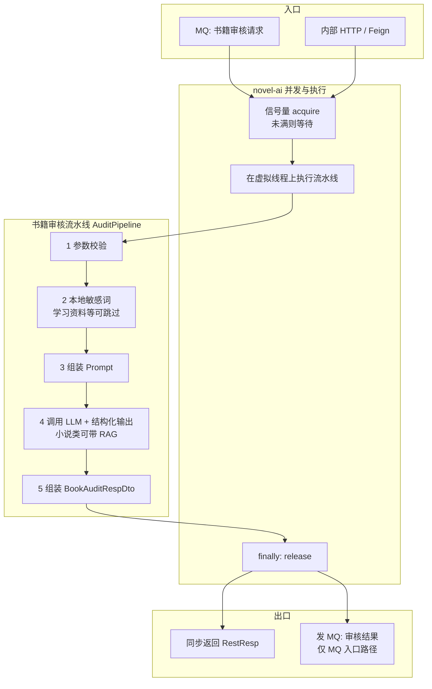

# 书籍审核链路执行流程

本文描述 **novel-ai-service** 中「书籍 AI 审核」从入口到返回/投递结果的执行路径，与章节审核区分：章节见同目录 [审核智能体-当前实现与改动.md](./审核智能体-当前实现与改动.md)。

---

## 一、入口

| 入口 | 说明 |
|------|------|
| **RocketMQ** | `BookAuditRequestListener` 消费「书籍审核请求」消息，组装 `BookAuditReqDto` 后调用审核服务。 |
| **内部 HTTP** | `InnerAiController` 对内暴露书籍审核接口，供 Feign 等同步调用。 |

二者最终都进入同一套 **文本服务 → 审核流水线** 逻辑。

---

## 二、执行前：并发闸门与执行载体

进入书籍审核后，在跑流水线之前会经过：

1. **信号量（全进程并发上限）**  
   同时执行的「书籍 + 章节」审核流水线总数不超过配置值（如 `novel.ai.audit.max-concurrent`）；超出则在闸门外阻塞等待，不丢弃任务。

2. **虚拟线程执行器（可配置关闭）**  
   流水线任务提交到虚拟线程执行器上执行；调用方线程需等待整次审核结束再返回（同步语义）。

---

## 三、流水线步骤（顺序固定）

装配见 `BookAuditPipelineFactory`：责任链依次执行，任一步可 **短路结束** 整条流水线。

| 顺序 | 步骤 | 作用 |
|------|------|------|
| 1 | 参数校验 | 校验请求合法性。 |
| 2 | 本地敏感词过滤 | 命中则可直接短路为不通过等；学习资料等类别可跳过。 |
| 3 | 组装 Prompt | 渲染模板；非学习资料可拼类别说明等。 |
| 4 | 调用大模型 | 结构化输出；**小说类**可在本次调用上挂载 **RAG（判例召回）**；学习资料路径不挂 RAG。 |
| 5 | 组装响应 | 生成业务侧书籍审核结果 DTO。 |

**说明**：RAG 不作为独立 Step，而在 LLM 步骤上通过检索增强顾问在请求发出前完成召回。

---

## 四、出口与回调

- **同步调用**：返回 `RestResp<BookAuditRespDto>`。
- **MQ 消费路径**：在监听器内拿到结果后，组装「书籍审核结果」消息 **再发 MQ**，供 book 等业务服务消费更新状态。

---

## 五、流程图

**短路示意**（未单独画分支）：敏感词或后续步骤若判定需立即结束，可不再执行后续 Step，直接携带结果走出流水线。

---

## 六、与章节审核的差异（便于对照）

| 项目 | 书籍审核 | 章节审核 |
|------|----------|----------|
| 流水线 Bean | `bookAuditPipeline` | `chapterAuditPipeline` |
| 是否分段多次 LLM | 否，通常单次模型调用 | 是，按字数切段后可能多次调用 |
| 入口监听器 | `BookAuditRequestListener` | `ChapterAuditRequestListener` |

书籍与章节 **共用** 同一套信号量并发上限。

---

*以仓库当前实现为准；配置键与类名变更时请同步更新本文。*
