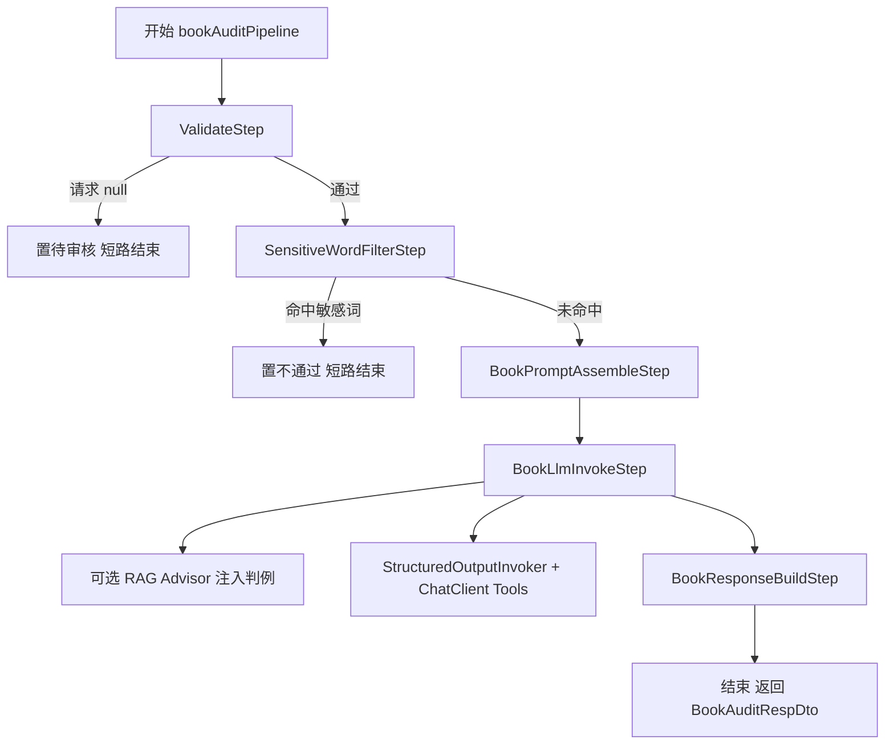
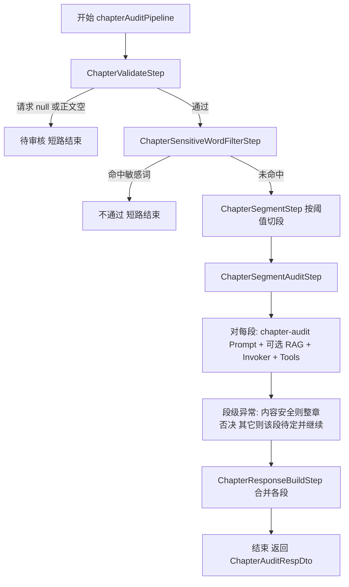
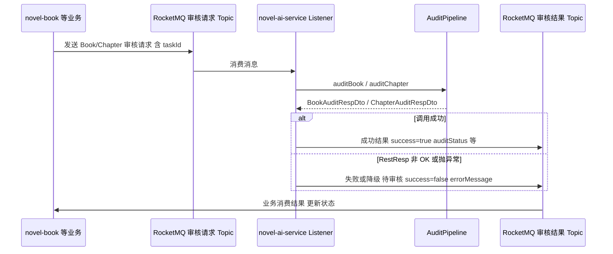

# novel-ai 模块说明（当前实现 · 大纲版）

> **文档性质**：基于 `turtle-website/novel-ai` 源码梳理的「当前实现」说明，与 `docs/module/ai-module.md`（面试版/偏早期架构叙述）**并存**；本文档侧重**代码真实状态**与**技术栈清单**，后续可在此文件逐节充实细节。  
> **不修改**既有 `ai-module.md` 等历史文档。

---

## 一、与旧版文档的差异（简要）

| 维度 | `ai-module.md` 侧重描述 | 当前代码实际状态 |
|------|-------------------------|------------------|
| 审核实现 | 以 `TextServiceImpl` 内大段 Prompt + 解析为主 | 书籍/章节审核已下沉为 **`agent` 包内 AuditPipeline + 多 Step** |
| 相似判例/RAG | 提及 Feign 调 `novel-search` | **本模块自建 ES 向量索引** + `RetrievalAugmentationAdvisor`，注释明确**不再反向依赖 novel-search** |
| 工具/Agent | 无 | **`AuditTools`（`@Tool`）** 挂入 `ChatClient.defaultTools`，支持 ReAct 式调用 |
| 对外协议 | HTTP + MQ | 另增 **Spring AI MCP Server**（`/sse` + `/mcp/message`），与同一套 Tool 元数据对齐 |
| 提示词 | 部分硬编码印象 | **`resources/prompts/*.st`** + `NovelAiPromptLoader`（StringTemplate） |
| 结构化输出 | Jackson + 正则兜底 | **`StructuredOutputInvoker`** + `BeanOutputConverter`，带可配置重试/修复策略 |
| 观测 | SkyWalking `@Trace` | 保留 + **Pipeline 级 Listener**（日志 / SkyWalking / **Micrometer**）+ Spring AI Observation（`gen_ai.*`） |

---

## 二、模块定位（当前）

- **AI 能力中台**：对上游屏蔽 DashScope 细节，提供稳定业务能力。
- **核心能力域**：
  - **内容审核**：书籍审核、章节审核（异步 MQ + 同步 Inner API）。
  - **创作增强**：文本润色、封面「二次提示词」生成。
  - **素材生成**：文生图（DashScope Image，带重试与可选 COS 转存——逻辑在 `ImageServiceImpl`，与旧文档一致方向）。
  - **审核治理扩展**：审核规则抽取、审核经验写入向量库、人审工单投递（MQ）、敏感词本地扫描。

---

## 三、技术栈清单（Maven / 运行时）

| 类别 | 技术/组件 | 说明 |
|------|-----------|------|
| 框架 | Spring Boot 3.x、Spring Cloud（OpenFeign、服务发现） | `NovelAiApplication`：`@EnableCaching`、`@EnableRetry`、`@EnableFeignClients`、`@EnableDiscoveryClient` |
| AI 抽象 | **Spring AI 1.x**：`ChatClient`、`ImageModel`、`BeanOutputConverter` | 文本/图模型统一抽象 |
| 厂商实现 | **Alibaba Cloud AI**：`spring-ai-alibaba-starter-dashscope` | 文本 `DashScopeChatModel`、图 `DashScopeImageModel`、Embedding（向量） |
| RAG | `spring-ai-rag`、`spring-ai-advisors-vector-store`、`spring-ai-starter-vector-store-elasticsearch` | `RetrievalAugmentationAdvisor` + 自建 `AuditExperienceDocumentRetriever` |
| 向量存储 | **Elasticsearch**（dense_vector，cosine，与 embedding 维度对齐） | 独立索引 `novel_ai_audit_experiences`，与 search 模块索引隔离 |
| MCP | `spring-ai-starter-mcp-server-webmvc` | HTTP+SSE，供 Cursor/Claude Desktop 等连接 |
| 消息 | **RocketMQ** | 审核请求消费、结果回发、人审任务等 |
| 可观测 | **SkyWalking** `apm-toolkit-trace`、**Micrometer**（Actuator `metrics`） | Pipeline 自定义指标 + `gen_ai.client.*` |
| 敏感词 | **Aho-Corasick**（`aho-corasick-double-array-trie`） | 本地词表 `sensitive-words.txt` |
| API 契约 | `novel-ai-api`（Feign 接口 + DTO） | 供其他微服务调用 |

---

## 四、技术选型（怎么做 & 为什么）

本节回答：**关键选型是什么、在工程里如何落地、取舍理由**。与第三节「清单表」互补——第三节列名词，本节写**决策链**。

### 4.1 总体原则

| 原则 | 说明 |
|------|------|
| **统一 AI 抽象** | 业务只依赖 Spring AI 的 `ChatClient` / `ImageModel` / `VectorStore`，厂商差异收敛在 starter 与配置，换模型主要改配置而非推翻业务代码。 |
| **横切与业务分离** | 重试、观测、RAG 注入等用 **Advisor** 或 **Pipeline Listener** 实现，避免每个接口复制粘贴。 |
| **微服务边界清晰** | 审核判例向量由 **本模块自管**（独立 ES 索引 + upsert API），不反向依赖 `novel-search` 做检索，降低耦合与发布牵连。 |
| **可观测优先** | 同时利用 Spring AI Observation（`gen_ai.*`）、SkyWalking 自定义 Tag、Micrometer 业务指标，便于线上定责与成本分析。 |

### 4.2 Spring AI 1.x + 阿里云 DashScope

**怎么做**：引入 `spring-ai-client-chat`、`spring-ai-alibaba-starter-dashscope`，通过 `spring.ai.dashscope.*` 配置 **同一账号**下的聊天模型、文生图模型、Embedding 模型；业务代码注入 `DashScopeChatModel` / `DashScopeImageModel` 或由 Boot 自动装配后交给 `ChatClient.builder(chatModel)`。

**为什么**：

- **与 Spring 生态一致**：`ChatClient`、Advisor、`BeanOutputConverter`、向量存储抽象均为官方扩展点，减少自研胶水代码。
- **国内线路与合规**：小说内容审核场景以中文为主，DashScope（百炼）延迟与账单路径适合国内部署；数据与账号体系落在阿里云，便于企业内统一治理。
- **一栈多模态**：文本审核、向量嵌入、文生图可在同一套密钥与监控下管理，运维成本低于「多供应商多 SDK」。

### 4.3 向量存储：Elasticsearch，而非单独部署 Milvus/Qdrant

**怎么做**：使用 `spring-ai-starter-vector-store-elasticsearch`，配置独立索引名（如 `novel_ai_audit_experiences`）、`dense_vector` 维度与 **cosine** 相似度，与 DashScope `text-embedding-v4` 的维度对齐；判例写入走 `AuditExperienceIndexer`，检索走 `AuditExperienceDocumentRetriever` + `RetrievalAugmentationAdvisor`。

**为什么**：

- **复用现有基础设施**：项目已具备 ES 集群（与检索/日志体系一致），无需为 AI 模块单独运维一套向量库，**TCO 最低**。
- **索引隔离**：审核向量索引与前台关键词搜索索引分离，避免 mapping 与写入模式互相干扰。
- **取舍**：ES 向量检索在超大规模纯向量场景下可能不如专用库极致；当前业务体量下 **工程收益大于理论极限性能**。

### 4.4 `elasticsearch-java` 版本在 ai 模块单独抬升（8.15.5）

**怎么做**：在 `novel-ai-service/pom.xml` 中**显式覆盖** `co.elastic.clients:elasticsearch-java` 为 **8.15.5**，与父 POM 中较低版本并存；仅本模块生效。

**为什么**（与 pom 注释一致）：

- Spring AI 1.0 的 `ElasticsearchVectorStore` 运行期依赖 **8.11+** 才有的 API（如 `KnnSearch.Builder`），旧版客户端会 `NoClassDefFoundError`。
- **不强行升级全仓库**：`novel-search` 等模块仍可用父 POM 锁定版本，避免无关模块被迫联调升级。
- **与 Boot 自带 REST 客户端版本对齐**，减少传输层冲突。

### 4.5 RAG：`RetrievalAugmentationAdvisor` + 局部挂载，而非全局 `QuestionAnswerAdvisor`

**怎么做**：在 `RagAdvisorConfig` 装配 `RetrievalAugmentationAdvisor`，使用 **`ContextualQueryAugmenter` + 自定义中文 PromptTemplate**（含「参考开始/结束」区块）；仅在 `BookLlmInvokeStep` / `ChapterSegmentAuditStep` 调用 `ChatClient` 时 **`.advisors(ragAdvisor)`**，并支持 `novel.ai.rag.enabled=false` 时整段不装配 Bean、自动退化为纯 Prompt。

**为什么**：

- **审核指令是中文结构化输出**，若使用默认 `QuestionAnswerAdvisor` 的英文 QA 包装，容易**抢走 system prompt 的语义锚点**，判例注入方式也不符合「在 user 侧拼接类案」的阅读习惯。
- **局部挂载**保证润色、封面提示词、规则抽取等**不需要判例**的调用不会被误召回，避免噪声与额外 token。
- **空召回**走 `emptyContextPromptTemplate`，等价于原样透传 query，不插入「I don't know」类英文提示。

### 4.6 `ChatClient` Advisor 链：瞬时重试 + 单次调用观测

**怎么做**：在 `AiConfig` 中为 `ChatClient` 注册 `defaultAdvisors`：**外层** `RetryTransientAiAdvisor`（仅对 `TransientAiException` 指数退避）、**内层** `StructuredOutputLogAdvisor`（单次调用耗时与 token 的日志 + SkyWalking Tag）、以及 Spring AI 自带的 `SimpleLoggerAdvisor`（DEBUG 级原文）。

**为什么**：

- **韧性**：限流、网关瞬时错误可通过重试消化；`NonTransientAiException`（如内容安全）不重试，避免浪费钱与放大封禁风险。
- **可观测**：重试在外层，**内层**仍记录「每一次真实打到模型的调用」，便于区分「一次业务审核」与「底层多次尝试」；并与框架层 `gen_ai.client.*` 指标互补。
- **结构化解析失败**由 `StructuredOutputInvoker` 内层处理，与 Advisor **职责分离**（Advisor 管传输层，Invoker 管 entity 修复）。

### 4.7 审核编排：`AuditPipeline` 责任链 + 多 Listener，而非单一大类

**怎么做**：书籍/章节分别定义 `AuditStep` 列表（校验、敏感词、Prompt、LLM、合并等），由 `AuditPipeline` 顺序执行，支持 **短路** 与 **异常映射**；`CompositeAuditPipelineListener` 组合日志、SkyWalking、Micrometer。

**为什么**：

- **单一职责**：每步可单测、可替换顺序（工厂类集中装配），比「一个 2000 行的 Service」更易维护。
- **成本敏感**：敏感词前置命中可直接 **短路**，跳过 Embedding 与 LLM，降低费用与延迟。
- **观测细化**：Step 级耗时与结果标签可落到 Micrometer，便于做「哪一步最慢」的治理。

### 4.8 敏感词：Aho-Corasick 双数组 Trie

**怎么做**：依赖 `aho-corasick-double-array-trie`，词表来自 `sensitive-words.txt`，封装为 `SensitiveWordMatcher`；在流水线 **LLM 之前**扫描书名/简介或章节全文。

**为什么**：

- **复杂度**：相对暴力多模式匹配，对长章节仍为 **O(n) 量级扫描**，适合在线路径。
- **确定性**：命中即按产品策略直接否决，不依赖模型「是否意识到」违禁词，与 LLM  probabilistic 输出形成**互补**。

### 4.9 异步解耦：RocketMQ

**怎么做**：业务侧发审核请求消息，`novel-ai` 侧 `RocketMQListener` 消费后调用与 HTTP **相同的** `TextService` 审核方法，再发结果消息；失败路径同样发 MQ，带 `success` / `errorMessage`。

**为什么**：

- **削峰与隔离**：审核慢路径不拖垮业务线程；AI 服务可独立扩容。
- **最终一致**：结果通过消息回传，符合事件驱动微服务常见模式。

### 4.10 MCP：`spring-ai-starter-mcp-server-webmvc`

**怎么做**：引入 WebMVC 版 MCP Server，通过 `ToolCallbackProvider` 注册与 `ChatClient.defaultTools` **同一套** `AuditTools`；暴露 SSE 与 JSON-RPC 端点（配置见 `spring.ai.mcp.server.*`）。

**为什么**：

- **与现有技术栈一致**：项目为 Spring MVC，选 **webmvc**  starter 避免引入 WebFlux 双栈与线程模型混用。
- **协议层复用**：工具元数据只维护一份，对内 Agent 与对外 Cursor/Claude Desktop **同源**，减少「两套 API」漂移。

### 4.11 API 模块与 Feign

**怎么做**：对外契约放在 `novel-ai-api`（路径常量 + DTO + `AiFeign`），服务实现留在 `novel-ai-service`。

**为什么**：调用方只引轻量 API 包，符合微服务 **接口与实现分离**；熔断降级在 `AiFeignFallback` 集中处理。

### 4.12 结构化输出：`BeanOutputConverter` + `StructuredOutputInvoker`

**怎么做**：用 `BeanOutputConverter<T>` 生成 JSON Schema 并拼进 system 提示；统一通过 `StructuredOutputInvoker` 调模型，失败时按配置做 **修复型重试**，与 Advisor 链解耦。

**为什么**：比纯正则抠 JSON **类型安全、可维护**；解析策略集中演进，业务 Step 只关心「已解析的 `AuditDecisionAiOutput`」。

---

## 五、已实现能力（按包/职责速览）

### 5.1 对外接口

- **Inner**：`InnerAiController` — 审核、润色、封面提示词、生图、`extractAuditRule`、审核经验 upsert（向量库）。
- **Front**：`FrontAiController`、`ChatController` — 作者侧与调试入口（与旧文档路径理念一致，以代码为准）。

### 5.2 Agent 流水线（`com.novel.ai.agent`）

- **书籍**：`BookAuditPipelineFactory` → Validate → SensitiveWordFilter → PromptAssemble → **LlmInvoke（可挂 RAG Advisor）** → ResponseBuild。
- **章节**：`ChapterAuditPipelineFactory` → Validate → SensitiveWordFilter → **Segment（切分）** → **SegmentAudit（逐段 RAG+LLM）** → ResponseBuild。
- **横切**：`AuditPipeline` + `BookAuditExceptionMapper` / `ChapterAuditExceptionMapper` + `AuditErrorClassifier`。
- **观测**：`LoggingPipelineListener`、`SkywalkingPipelineListener`、`MicrometerPipelineListener`。

### 5.3 工具与 MCP（`AuditTools` + `McpToolRegistrationConfig`）

- `@Tool` 方法：政策查询、相似判例向量检索、按书维度判例、敏感词扫描、人审工单投递、判例入库等（以源码为准）。
- `ChatClient`：`defaultTools(auditTools)`；MCP 通过 `ToolCallbackProvider` 复用同一实例。

### 5.4 RAG（`rag` + `RagAdvisorConfig`）

- 判例写入：`AuditExperienceIndexer`；检索：`AuditExperienceDocumentRetriever`。
- **局部挂载**：仅在书籍/章节 LLM 步骤 `advisors(ragAdvisor)`，避免润色/封面等场景误注入。

### 5.5 提示词（`prompt` + `resources/prompts`）

- `*.st` 模板：`book-audit`、`chapter-audit`、`text-polish`、`cover-prompt`、`audit-rule-extract` 等。

### 5.6 其他

- **结构化输出**：`StructuredOutputInvoker` + `NovelAiStructuredOutputProperties`。
- **Advisor**：`RetryTransientAiAdvisor`、`StructuredOutputLogAdvisor`（与 `novel.ai.advisor.*` 配置联动）。
- **MQ**：`BookAuditRequestListener`、`ChapterAuditRequestListener`、`HumanReviewTaskProducer` 等（主题/Tag 见 `AiMqConsts` 与配置）。

---

## 六、审核流程

### 6.1 入口说明

审核有两类入口，**底层都走同一套 `TextService` → `AuditPipeline`**：

| 入口 | 典型调用方 | 说明 |
|------|------------|------|
| **同步 HTTP** | `InnerAiController`、其他服务 **Feign** | `POST .../audit/book`、`.../audit/chapter`，直接执行流水线并返回 `RestResp` |
| **异步 MQ** | `novel-book` 发审核请求 | `BookAuditRequestListener` / `ChapterAuditRequestListener` 消费后组装 DTO，调用 `textService.auditBook` / `auditChapter`，再发**结果 Topic** |

流水线共性（见 `AuditPipeline`）：

- 按顺序执行多个 `AuditStep`；任一步返回 **短路**（`StepResult.SHORT_CIRCUIT`）则**立即结束**，不再执行后续 Step。
- 任一步**抛异常**则交给 `AuditExceptionMapper` 转成业务响应（如待审核/不通过），并回调 Listener。

### 6.2 书籍审核（Book）流水线

**Step 顺序**（`BookAuditPipelineFactory`）：`Validate` → `SensitiveWordFilter` → `PromptAssemble` → `LlmInvoke` → `ResponseBuild`。

| Step | 行为要点 |
|------|----------|
| **Validate** | 请求为 `null` → 置「待审核」并**短路** |
| **SensitiveWordFilter** | 扫描书名+简介；命中敏感词 → **不通过**（置信度 1.0）并**短路**，跳过 RAG/LLM |
| **PromptAssemble** | 渲染 `book-audit` 的 system/user，并附加 `BeanOutputConverter` 的 JSON 格式说明 |
| **LlmInvoke** | `StructuredOutputInvoker` 调 `ChatClient`；可选局部挂载 `RetrievalAugmentationAdvisor`（`novel.ai.rag.enabled=true` 时）；全局仍带 `defaultTools(AuditTools)` |
| **ResponseBuild** | `AuditDecisionResolver` 将 `AuditDecisionAiOutput` 转为 `BookAuditRespDto` |

### 6.3 章节审核（Chapter）流水线

**Step 顺序**（`ChapterAuditPipelineFactory`）：`Validate` → `SensitiveWordFilter` → `Segment` → `SegmentAudit` → `ResponseBuild`。

| Step | 行为要点 |
|------|----------|
| **Validate** | 请求 `null` → 待审核并**短路**；正文为空/空白 → 待审核（原因：需人工）并**短路** |
| **SensitiveWordFilter** | 扫描标题+正文；命中 → **不通过**并**短路** |
| **Segment** | `ChapterContentSplitter` 按 `novel.ai.chapter.max-content-length`（默认 5000 字）切段，多段时打 SkyWalking `segments.count` |
| **SegmentAudit** | **对每一段**：渲染 `chapter-audit` prompt + 结构化格式 → `StructuredOutputInvoker` + 可选 RAG；**段级异常**：内容安全类 → 整章立即不通过；其他异常 → 该段记待审核并继续下一段（见源码注释） |
| **ResponseBuild** | 合并各段决策为最终 `ChapterAuditRespDto` |

### 6.4 MQ 异步全链路（业务侧 ↔ novel-ai）

消费者将 MQ 体转为 `BookAuditReqDto` / `ChapterAuditReqDto` 后，与 HTTP 路径**共用** `TextService` 审核逻辑；成功或失败都会向**结果 Topic** 发消息，避免业务侧一直等不到回执。

### 6.5 与 RAG / Tool 的关系（读图补充）

- **RAG**：仅在 **LlmInvoke（书）** 与 **SegmentAudit（章）** 中通过 `RetrievalAugmentationAdvisor` **局部**挂载；关闭 `novel.ai.rag.enabled` 时退化为纯 Prompt。
- **Tool**：`ChatClient` 全局 `defaultTools(AuditTools)`，模型在审核对话中可按需发起工具调用；与 MCP 暴露的是同一套工具定义。

---

## 七、正文大纲（待充实）

以下为建议目录结构，后续可按需扩展小节与示意图。**技术选型（怎么做、为什么）** 已在 **第四节** 成文；第三节为技术栈速查表。

1. **概述**  
   - 业务定位、与 `novel-book` / `novel-user` / 网关的协作关系（配架构图可选）。

2. **模块与工程结构**  
   - `novel-ai-api` vs `novel-ai-service` 职责划分、包结构导览（`agent`、`tool`、`rag`、`mq`、`invoker`）。

3. **依赖与配置**  
   - DashScope（chat/image/embedding）、ES 向量索引、RAG 开关与阈值、Advisor 重试、MCP 端点、RocketMQ；**敏感信息仅写占位符**。

4. **核心业务流程**  
   - 4.1 书籍审核流水线（Step 顺序、异常映射、结果字段语义）。  
   - 4.2 章节审核（切分策略、段合并规则、与书籍差异）。  
   - 4.3 润色 / 封面提示词 / 规则抽取（与审核解耦、无 RAG）。  
   - 4.4 文生图与持久化策略（重试、COS、临时 URL）。  
   - 4.5 MQ 异步审核全链路（请求 → 消费 → 回传结果）。

5. **RAG 与向量库**  
   - 索引设计、metadata 字段、写入路径、召回参数、空上下文行为。

6. **Agent 工具（Function Calling）与 MCP**  
   - 工具列表与调用约定、与 ChatClient 双链路、MCP 安全与运维注意点。

7. **可观测性与运维**  
   - SkyWalking 标签、Micrometer 自定义指标、`gen_ai.client.*`、Actuator 入口、常见告警场景。

8. **测试与质量**  
   - 现有单测覆盖（Pipeline Step、Merger、Splitter、Classifier 等）与本地联调要点。

9. **已知限制与演进方向**  
   - 与 `docs/ai模块改造/` 中规划的对照（可选，避免重复粘贴大段）。

10. **附录**  
    - API 路径索引（Inner/Front）、MQ Topic/Tag 表、Prompt 文件列表、关键类索引。

---

## 八、下一步（充实本文档时建议优先写的块）

1. 将 **章节审核「分段合并规则」与置信度聚合** 从代码提炼为可背诵的决策表（对齐 `ChapterResponseBuildStep` / merger）。  
2. 将 **`AuditTools` 每个 Tool 的入参/出参/失败行为** 整理成表格。  
3. 将 **配置项** 整理为「名称 → 默认值 → 调优建议」（剔除真实密钥）。  
4. 补 **序列图**：MQ 审核、带 RAG 的 LLM 调用、MCP 客户端一次完整会话。

---

## 九、面试能力全景：已实现 vs 待演进

### 9.1 先对齐认知（避免「过时缺口」）

早期改造路线里曾把 **「缺 Tool Calling / 缺 MCP」** 列为最优先缺口；**以当前仓库为准，这两项已落地**：

- **Function Calling**：`AuditTools` 使用 Spring AI `@Tool`，并在 `AiConfig` 中通过 `ChatClient.builder(...).defaultTools(auditTools)` 全局挂载，模型可在审核对话中发起工具调用。
- **MCP**：依赖 `spring-ai-starter-mcp-server-webmvc`，`McpToolRegistrationConfig` 注册 `ToolCallbackProvider`，与 ChatClient 共用同一 `AuditTools` 实例；端点见 `application.properties` 中 `spring.ai.mcp.server.*`（如 `/sse`、`/mcp/message`）。

面试叙事应写成：**「已具备工具调用 + MCP 对外暴露」**；若仍说「只有 NLP 管道、没有 Tool」，会与代码不一致。

### 9.2 按「大厂面试打点」对照表（状态以代码为准）

| 类别 | 能力 | 技术关键词 | 状态 | 说明 |
|------|------|------------|------|------|
| 模型调用 | `ChatClient` + 全局 Advisor 链 | Spring AI 1.0 Advisor、`SimpleLoggerAdvisor` 等 | **已有** | `AiConfig` 装配 `RetryTransientAiAdvisor`、`StructuredOutputLogAdvisor` |
| 重试架构 | 两级：瞬时错误 + 结构化输出修复 | 指数退避、`AuditErrorClassifier`、修复型 Prompt | **已有** | `novel.ai.advisor.*` + `novel.ai.structured-output.*` + `StructuredOutputInvoker` |
| 结构化输出 | `BeanOutputConverter` + Invoker | JSON Schema、类型安全 | **已有** | 润色/规则抽取等路径使用 |
| Prompt 工程 | 外置模板 | StringTemplate、可版本管理 | **已有** | `resources/prompts/` 下 **10 个** `.st`（书籍/章节审核、润色、封面、规则抽取等成对 system/user） |
| 前置过滤 | 敏感词 | Aho-Corasick、O(n) 扫描 | **已有** | `SensitiveWordMatcher` + 流水线内 `*SensitiveWordFilterStep`；与 Tool 侧 `checkSensitiveWords` 并存 |
| Agent 编排 | 多 Step Pipeline + 短路 + 异常翻译 | 责任链、`AuditPipelineListener` 组合 | **已有** | 书籍 5 步、章节含切分+逐段审核；`CompositeAuditPipelineListener` |
| RAG | ES 向量 + `DocumentRetriever` + RA Advisor | 嵌入、cosine、零反向依赖 search | **已有** | `novel_ai_audit_experiences` 索引；审核 LLM 步骤局部 `advisors(ragAdvisor)` |
| 观测 | Log / SkyWalking / Micrometer + Observation | `gen_ai.*`、APM | **已有** | Pipeline 级 Listener + `StructuredOutputLogAdvisor` 等 |
| 解耦 | 向量 upsert API、去 Feign 依赖 search | 边界清晰 | **已有** | `InnerAiController` 暴露判例写入；RAG 自管向量库 |
| 测试 | 单测全绿 | JUnit5、Mockito | **已有** | 当前工程 **62** 个测试通过（以本地 `mvn test` 为准） |
| **Tool Calling** | 模型可调外部能力 | `@Tool`、`defaultTools` | **已有** | 见 9.3 |
| **MCP Server** | 协议对外暴露工具 | SSE、JSON-RPC | **已有** | 与 Tool 元数据同源 |
| ChatMemory | 章节间共享上下文 | `MessageWindowChatMemory`、Token 预算 | **未做** | 适合「同一本书连续多章」伏笔一致性叙事 |
| 模型分级路由 | 成本/风险分档 | `TierSelectAdvisor`、多 `ChatModel` | **未做** | 简历可量化降本时需先落地路由与埋点 |
| 离线评测 | 准召、回归 | Spring AI Evaluator、黄金集 | **未做** | 与 Prompt 版本联动价值高 |
| 审核结果自动飞轮 | 审完自动写向量 | 异步、幂等、质量门槛 | **部分** | `recordAuditExperience` Tool 已具备；**主链路自动沉淀**仍可加强 |
| Prompt 热更新 | Nacos 动态模板 | 配置中心、无重启 | **未做** | 当前以 classpath `.st` 为主 |
| Streaming | 润色 SSE | WebFlux/SSE、背压 | **未做** | 体验与长文本场景加分项 |

### 9.3 已落地的 `AuditTools`（Function Calling 清单）

以下均为 `@Tool`，失败路径以**返回空结果/错误描述、尽量不抛异常**为原则（避免打断模型 ReAct 循环），具体见源码 `com.novel.ai.tool.AuditTools`：

| # | 方法（示意） | 职责 |
|---|----------------|------|
| 1 | `queryPlatformPolicy` | 按主题查平台政策条款（Nacos 配置 `NovelAiPolicyProperties`） |
| 2 | `querySimilarViolations` | 向量库语义检索相似违规判例 |
| 3 | `queryRecentAuditDecisionsForBook` | 按书籍维度查近期相关判例 |
| 4 | `checkSensitiveWords` | 敏感词命中扫描 |
| 5 | `escalateToHuman` | 投递人审工单（MQ） |
| 6 | `recordAuditExperience` | 判例写入向量索引（沉淀飞轮） |

**说明**：若简历要写「作者累犯画像、用户中心 Feign」类工具，需在 **user/author 域提供查询接口** 后再加 `@Tool`，当前仓库未强制包含「作者 ID → 历史违规次数」独立 Tool。

### 9.4 仍建议按 ROI 补强的路线（与 9.2 未做项对应）

| 顺序 | 方向 | 工作量量级 | 简历/面试收益 |
|------|------|------------|----------------|
| 1 | **模型分级路由 + 调用量/成本埋点** | 中 | 可量化「降本 XX%」 |
| 2 | **ChatMemory（书维度或会话维度）** | 中 | 「多章上下文一致」故事完整 |
| 3 | **主链路自动沉淀判例**（带质量门槛/幂等） | 低～中 | RAG 飞轮闭环，少依赖模型自觉调用 `recordAuditExperience` |
| 4 | **Spring AI Evaluator / 离线评测集** | 中～高 | 准召、回归、Prompt 迭代有据 |
| 5 | **Prompt 热更新（Nacos）** | 低 | 运维与法务调规则不发版 |
| 6 | **润色等场景 SSE Streaming** | 低～中 | 交互体验 |

### 9.5 简历可用表述（与代码一致版）

**基础版（偏工程落地）：**

> 基于 Spring AI 1.0，落地「两级重试 Advisor + 责任链式审核 Pipeline + ES 向量 RAG」；覆盖书籍/章节审核、润色、封面与规则抽取；集成 `gen_ai.*` 与 SkyWalking / Micrometer；单测 **62** 个全绿。

**强化 Agent 叙事版（含 Tool + MCP，避免夸大未实现项）：**

> 在审核链路中挂载 **Spring AI `@Tool` 工具集**（政策、向量判例、敏感词、人审工单、判例入库），并通过 **MCP Server（SSE）** 与 Cursor / Claude Desktop 等客户端共用同一套工具元数据；RAG 采用 Elasticsearch 向量库与 `RetrievalAugmentationAdvisor` 局部注入。

---

*（大纲版：第 1～8 节与附录规划仍可按需扩充；第 9 节随实现迭代更新「状态」列即可。）*
