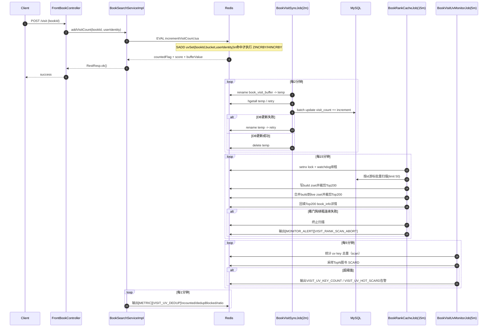

# turtle-website 缓存管理深度剖析

## 一、整体架构：两级缓存（L1 + L2）

项目采用 **Caffeine（本地）+ Redis（分布式）两级缓存架构**。

### 为什么这样设计？

| | Caffeine | Redis |
|---|---|---|
| 访问延迟 | 纳秒级（进程内） | 毫秒级（网络IO） |
| 容量 | 受JVM堆限制，适合小容量 | 独立进程，容量大 |
| 数据一致性 | 多节点各自一份，一致性差 | 集中存储，多节点共享 |
| 适合场景 | 全局唯一、读极多、写极少的数据 | 用户个人数据、跨节点需共享的数据 |

项目将**首页推荐、书籍基础信息**放 Caffeine，将**用户信息、作者信息**放 Redis。这是对业务的精准判断：书籍基础信息几乎不变，用本地缓存最快；用户信息在多实例部署时需跨节点一致。

**核心配置 `CacheEnum`** 通过 `type` 字段静态指定每个缓存的存储位置：

```18:25:novel-core/novel-common/src/main/java/com/novel/common/constant/CacheConsts.java
public enum CacheEnum {
    HOME_BOOK_CACHE(0, ..., 60*60*24, 1),       // type=0: 仅 Caffeine
    BOOK_VISIT_RANK_CACHE(2, ..., 60*60*6, 1),  // type=2: 仅 Redis
    BOOK_CONTENT_CACHE(2, ..., 60*60*12, 3000), // type=2: 仅 Redis
    USER_INFO_CACHE(2, ..., 60*60*24, 10000),   // type=2: 仅 Redis
    // ...
}
```

---

## 二、访问量与点击榜：防刷版三轨架构（当前线上方案）

当前点击榜采用“**实时计数（带 UV 去重）+ 批量落库 + 全量校准**”三轨并行，目标是同时兼顾防刷、实时性和准确性。

### 1) 实时轨：Lua 原子去重 + 条件计数

访问接口不会直接 `INCR`，而是调用 Lua 脚本做“先去重后计数”：

- 去重 key：`book_visit_uv:{bookId}:{bucket}`（按 2 分钟窗口分桶）；
- `SADD` 成功（新访客）才执行：
  - `ZINCRBY visit_rank`（实时榜分数）
  - `HINCRBY book_visit_buffer`（待落库增量）
  - `HINCRBY book_info:{bookId}.visitCount`（热点详情）
- `SADD` 失败（窗口内重复）则不计数；
- 去重 Set 设置 TTL（默认 300 秒），避免无限膨胀。

这样可以在不改主链路的前提下，把“重复刷点击”挡在入口。

### 2) 批量落库轨：2 分钟增量同步（最终一致）

`BookVisitSyncJob` 每 2 分钟执行一次：

- 先把 `book_visit_buffer` 原子 `rename` 到临时 key；
- 批量 `UPDATE visit_count = visit_count + increment`；
- 失败时写入 `retry`，下轮先重试。

该链路只负责 Redis -> DB 持久化，不负责实时展示。

### 3) 全量校准轨：主键游标扫描纠偏

`BookRankCacheJob.refreshVisitRankCache()` 每 15 分钟执行一次全局纠偏：

1. 按主键游标扫描（`id > lastId order by id limit 50`）；
2. 构建 `build zset` 并持续裁剪到 Top200；
3. 候选分数取 `DB + buffer + retry`；
4. 完成后合并回 `live zset`，再裁剪 Top200；
5. 基于 Top200 回填 `book_info:*` 详情缓存（不覆盖实时 `visitCount`）。

这个流程不依赖 `visit_count` 索引，能兜底黑马上榜和长周期偏差。

### 4) 多实例安全：分布式锁 + 看门狗 + 熔断

校准任务使用 token 锁，保证同一时刻仅一个实例执行：

- 抢锁：`SET NX EX`；
- 看门狗续租：每 30 秒 Lua 校验 token 后 `EXPIRE`；
- 安全解锁：Lua 校验 token 后删除锁；
- 连续续租失败达到阈值（默认 3）立即中止任务；
- 输出结构化告警：`[MONITOR_ALERT][VISIT_RANK_SCAN_ABORT]`。

### 5) 监控与告警：防刷效果可观测

已增加两类关键可观测能力：

1. 访问去重指标日志（每分钟）
   - 日志前缀：`[METRIC][VISIT_UV_DEDUP]`
   - 字段：`counted`、`dedupBlocked`、`blockedRatio`

2. UV 容量与热点告警（每 5 分钟）
   - UV key 总量阈值告警：`[MONITOR_ALERT][VISIT_UV_KEY_COUNT]`
   - 热点书籍 `SCARD` 阈值告警：`[MONITOR_ALERT][VISIT_UV_HOT_SCARD]`
   - 采样范围：实时榜 TopN（默认 30）

### 7) 防缓存穿透：空值缓存 + 布隆过滤器

随着“非热门书籍也缓存”上线，系统新增了两层防穿透保护：

1. 空值缓存（短TTL）
   - key：`book_info_null:{bookId}`
   - TTL：120 秒
   - 场景：当书籍不存在（或不满足可读条件）时写入空值缓存，短时间内重复请求不再打DB

2. 书籍存在性布隆过滤器（前置拦截）
   - 线上key：`book_exist_bloom`
   - 构建key：`book_exist_bloom:build`
   - 查询流程：先布隆判断，不存在直接返回并写短空值缓存；可能存在再走 Redis/DB

### 8) 布隆过滤器维护策略（当前实现）

1. 定时重建
   - 每天凌晨4点重建一次全量布隆
   - 启动时额外重建一次，避免新环境布隆为空
   - 重建流程：写 build key -> 完成后切换到 live key

2. 增量维护（关键）
   - 为避免“4点后新通过书籍被误拦截”，审核通过路径会增量加入布隆
   - 仅在以下条件同时满足时执行增量：
     - `auditStatus = 1`（审核通过）
     - `lastChapterName` 非空（存在有效最新章节）
   - 该条件已接入：
     - AI 书籍审核通过
     - AI 章节审核通过并更新最新章节后
     - 人工书籍审核通过
     - 人工章节审核通过并更新最新章节后

3. 设计取舍
   - 布隆只做“可能存在”判断，允许极低误判，不会漏掉已在布隆中的有效ID
   - 空值缓存使用短TTL，减少对新上架/新过审书籍的误伤时间窗口

### 6) 时序图版流程（汇报可直接使用）



---

## 三、热点隔离：只预热榜单书籍

```127:148:novel-book/novel-book-service/src/main/java/com/novel/book/service/impl/BookReadServiceImpl.java
// 判断是否在点击榜 ZSet 中
Double zsetScore = stringRedisTemplate.opsForZSet().score(BOOK_VISIT_RANK_ZSET, bookId);
boolean isInRank = (zsetScore != null && zsetScore > 0);
if (isInRank) {
    // 连载中 12 小时；已完结 7 天（完结后内容不变，可缓存更久）
    long ttl = bookInfo.getBookStatus() == 1 ? 604800L : 43200L;
    stringRedisTemplate.opsForValue().set(cacheKey, json, ttl, TimeUnit.SECONDS);
}
```

**为什么这样做？** 这是**热点隔离**思想的体现：
1. 如果所有书籍的章节内容都缓存，Redis 内存会爆炸（一本书几百章）
2. 长尾书籍访问量极低，缓存命中率几乎为零，性价比极低
3. 以 ZSet 排行榜为准，天然过滤出真正的热门内容

---

## 四、缓存三大问题的防护措施

### 1. 防缓存穿透
- 所有 `RedisCacheManager` 配置 `disableCachingNullValues()`，不缓存 null
- `@Cacheable` 注解的 `unless` 条件防止空集合写入：`unless = "#result == null || #result.data.isEmpty()"`
- 只有榜单热门书籍才写 Redis，非热门书籍不存在 Key，自然减少了穿透可能

### 2. 防缓存击穿
- **启动预热**：使用 `@EventListener(ApplicationReadyEvent.class)`，服务启动完成后立即预热所有榜单缓存，保证冷启动期间不打穿 DB
- 榜单数据访问量极高，ZSet 常驻 Redis 不过期，几乎不可能出现击穿

### 3. 防缓存雪崩
- 各缓存 TTL **刻意错开**：1分钟、6小时、12小时、18小时、24小时、48小时，避免集中过期
- 书籍分类等几乎不变的数据设 TTL=0（永不过期），彻底消除该类雪崩风险
- 定时任务错峰调度（`:00`、`:05`、`:10` 分钟偏移），避免多任务同时冲击 DB

---

## 五、缓存与数据库一致性

### 核心模式：Cache-Aside（旁路缓存）

```java
// 读：先缓存，未命中再查DB
// 写：先写DB（事务内），事务提交后删缓存
```

### 关键设计：事务提交后再发MQ删缓存

```java
// BookAuthorServiceImpl.java
TransactionSynchronizationManager.registerSynchronization(
    new TransactionSynchronization() {
        @Override
        public void afterCommit() {
            // 事务真正提交后，才发送 MQ 通知删缓存
            mqService.sendBookChangeMsg(bookId);
        }
    }
);
```

**为什么要在事务提交后才删缓存？** 如果在事务内就删缓存：
1. 其他线程读到缓存 miss，查 DB 拿到旧数据（事务未提交）
2. 将旧数据回写缓存
3. 原事务提交，DB 是新数据，但缓存却是旧数据 → **永久脏缓存**

先写 DB、事务提交后删缓存，即使中间有线程查到旧缓存，过期后也会从 DB 拿到最新数据。

---

## 六、幂等性保护（用 Redis 实现）

### 评论防抖（防重复提交）

```java
// SETNX + 3秒TTL，同一用户3秒内只能提交一次评论
Boolean success = stringRedisTemplate.opsForValue()
    .setIfAbsent("comment:debounce:" + userId + ":" + bookId, "1", 3, TimeUnit.SECONDS);
```

### 积分扣减幂等

```java
// SETNX + 24小时TTL，同一笔积分操作只扣一次
Boolean isSet = stringRedisTemplate.opsForValue()
    .setIfAbsent(idempotentKey, "1", Duration.ofHours(24));
```

---

## 七、安全场景：JWT Token 黑名单

```java
// 登出时，将 Token 的 MD5 Hash 写入 Redis，TTL = Token 剩余有效期
// 每次请求验证 Token 时，检查 MD5 是否在黑名单中
```

**为什么用 MD5 压缩 Key？** JWT Token 本身可能有几百字节，直接作 Key 浪费内存，MD5 固定 32 字符，且碰撞概率极低（对 JWT 安全性来说足够）。

---

## 面试时的总结话术

> 项目的缓存核心设计思想是**"分层、隔离、最终一致"**：
> - **分层**：本地 Caffeine 承接不可变的全局数据，Redis 处理需跨节点共享的用户态数据
> - **隔离**：以排行榜 ZSet 为门槛，只缓存热点书籍内容，从根源控制内存膨胀
> - **最终一致**：写操作采用 Cache-Aside + 事务后 MQ，访问量采用 Write-Behind + Lua 原子 + rename 隔离，在高并发和数据一致性之间取得平衡